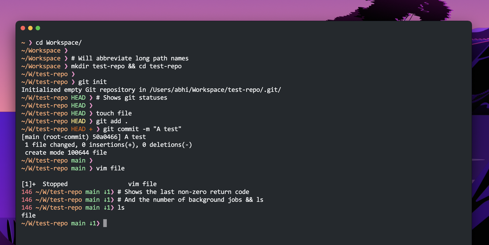

Baksho
======

A minimalistic, clean prompt for Bash.

<p align="center"></p>

Installation
------------
- Run the following command
    ```bash
    curl -fsSL https://raw.githubusercontent.com/abhi-g80/baksho/main/install.sh | sh
    ```

- Or you may clone the repo and add the following lines to your `bashrc`
    ```bash
    if [ -f ~/baksho-theme.sh ]; then
      source ~/baksho-theme.sh
    fi
    ```
    Make sure to copy or move the `baksho` script to your `$HOME`.

Credits
-------
This theme is heavily inspired by the [Common](https://github.com/jackharrisonsherlock/common) theme for ZSH shell.